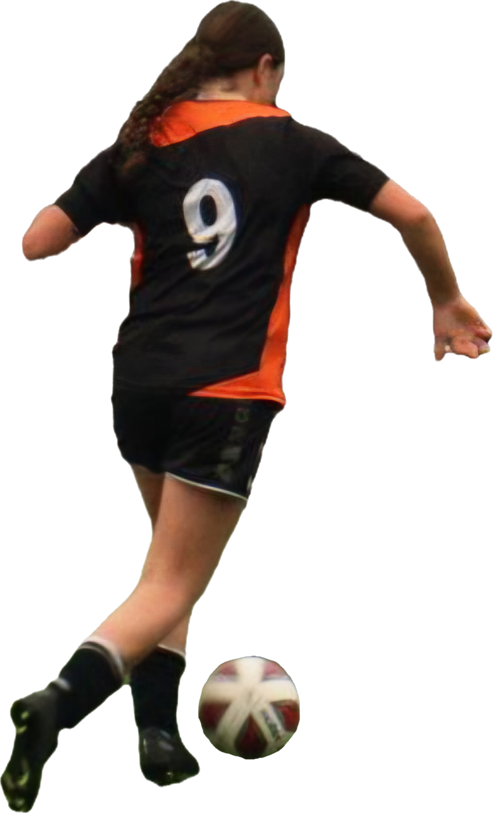

  

  
  
  
  
     
  
  <b>Coding is Fun 🚀</b> 
  <i>"Do what you love and love what you do!"</i>

 

---

### About Me

  
  
📍 Bern, Switzerland 🇨🇭  
🎓 Apprenticeship as Software Developer (IT Specialist)  
📚 2nd Year  
💻 Web Development, Python & Design  
☕ Powered by Coffee & good music  

 

---

### My Tech Stack & Tools

  
  
  
  
  
  
  
  
  
  
  
  

---

### Hobbies & Interests

  

  * **Soccer:** Playing for FC Kirchberg Women's Team  
  * **Sports:** Staying active and keeping fit  
  * **Coding & Scripts:** Trying out new frameworks and building projects  
  * **Music:** Listening to music while coding and doing sports  

 

---

### GitHub Stats

  
  
  

 

  

---

### Connect with me!

  
 

  

